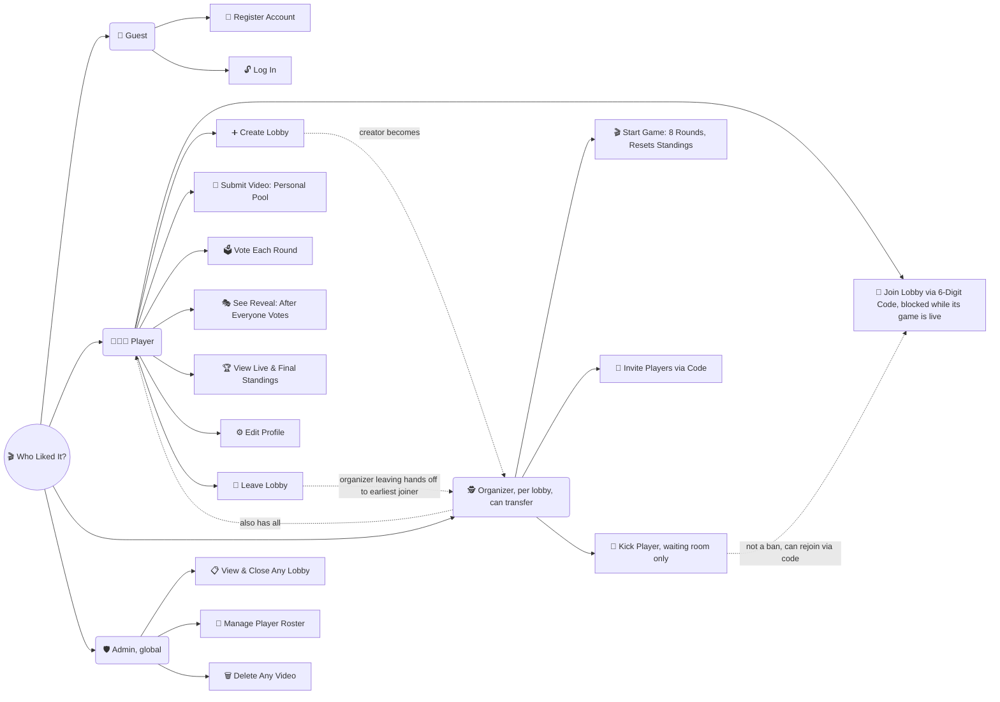

# Who Liked It?

A party game for friend groups, inspired by the classic "3 friends arguing over who liked a video in the shared Liked tab" moment on TikTok. Everyone secretly submits links to videos they've personally liked into their own pool. Each round, the app randomly draws one submitted video without saying whose it is, and the group votes on who they think liked it. Once everyone's guessed, the answer is revealed at once and points go to whoever guessed right — 8 rounds per game, then final standings, and the same group of friends can replay endlessly. Players join or create lobbies with a 6-digit code, and an Organizer (whoever created the lobby, with the role transferring if they leave) starts games and manages who's in the waiting room. Since TikTok has no public API for reading someone's Liked Videos or inbox, there's no scraping or burner-account trickery — submission is simply self-service, straight into the app's own database. It's built with plain HTML/CSS/JS on the frontend and Supabase for auth and the database, with no custom backend server needed. Right now this is a personal learning project in the design/prototyping stage: the concept, roles, and schema are fully designed, and a clickable HTML mockup ([`who-liked-it-mockup-v3.html`](./who-liked-it-mockup-v3.html)) exists to preview every screen, but the real Supabase-backed app hasn't been built yet. Full decision history lives in [`PROJECT_HANDOFF.md`](./PROJECT_HANDOFF.md).

## Roles

