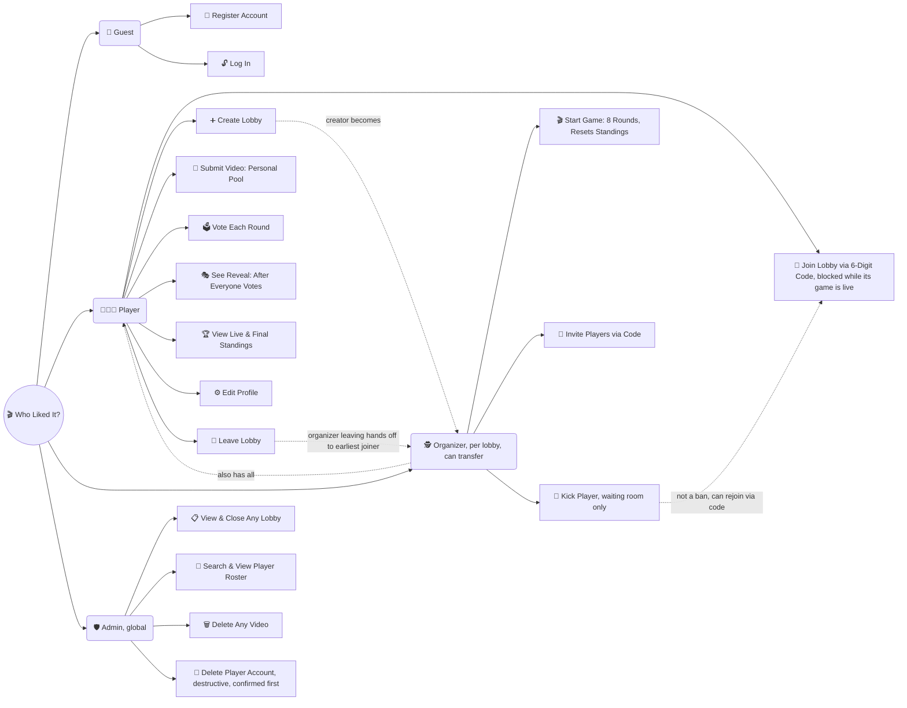

## Roles

- **Guest** — someone who has the app link but hasn't registered/logged in yet. Can only register an account or log in; every other tab is visible but locked (greyed out, not clickable) until then.
- **Player** — anyone with an account. Can submit videos to their own personal pool (not tied to any one lobby), join an existing lobby using its 6-digit code (**blocked while that lobby's game is already running** — joining only works before Start Game or after the game finalizes), or create a brand-new lobby (which makes them that lobby's Organizer). Within a lobby's game they vote each round, see the reveal once everyone in the lobby has voted, view live standings (updated after each round) and final standings (after round 8), and **leave the lobby**. Can also **edit their profile** (display name, email, photo) any time while signed in. A player can be a member of multiple lobbies.
- **Organizer** — a **per-lobby** role, not global: starts as whoever created the lobby, but the role **transfers** if they leave — it passes automatically to whichever remaining member joined that lobby earliest. Does everything a Player does inside that lobby, plus: **starting a game** (an 8-round session that draws from members' personal video pools and resets standings to zero each time it starts — this covers both the first game and any replay), inviting people by sharing the lobby's join code, and **kicking a player — waiting room only, not mid-game**. A kicked player isn't banned; they can rejoin later with the code like anyone else, same as a normal leave. Does **not** manage the evidence pool directly — that's Admin's job.
- **Admin** — a **global** role, above all lobbies. Can see a list of every open lobby across the app **and close any of them**, search/view the player roster, delete any video/post in any lobby (moderation/cleanup), and separately **delete a player's account entirely** — a destructive, irreversible action (removes them from every lobby and deletes everything they've submitted), so it's called out as its own action and requires confirmation before it happens, distinct from just browsing the roster. Currently just the trainee's own account — no admin-management UI planned for now.

## Lobbies are temporary

A lobby only exists while it has at least one member. When the last player leaves, the lobby closes: its guesses/points/standings are wiped (they only ever belonged to that lobby), but every video anyone submitted stays saved even after the lobby is gone, unless Admin deletes it directly (A3).

## Game sessions

Joining a lobby drops you into a **waiting room** until the Organizer clicks Start Game — from there the Organizer can also **kick** a member if needed, but only while still in the waiting room (kicking mid-game isn't possible, and kicking isn't a ban — the kicked player can just rejoin with the code later). Once Start Game is clicked, that lobby's **join code stops working for new members** until the game finalizes — membership is locked for the duration of a game. A game is a fixed **8-round** sequence: each round draws an unused video from the current members' pools, everyone votes, and the app **waits for the whole lobby to guess** before revealing simultaneously and updating standings, then auto-advances. After round 8 the game finalizes with final standings, and joining opens back up. The same lobby can play again — starting a new game **resets standings to zero**, they never carry over between games.

**Once you enter a lobby, it takes over the whole screen** — no tab bar, no way to jump to Submit Video or Home, whether you're in the waiting room or mid-round. There are exactly two ways back: leave early (which ends your membership — rejoining later means typing its code in again, and rejoining as Player rather than Organizer, since that role already transferred to someone else the moment you left), or finish the game and return to the normal app from the Final Results screen, without losing your membership in the lobby. There's no browsable list of lobbies you're in — Join/Create are the only ways in, always by code.

The join code itself is only ever shown **inside** the lobby (every member sees it there, not just the Organizer) — Home never displays a lobby's code, so sharing it means being in the lobby to read it off.

## How videos get into the app

There's no burner TikTok account and no automated scraping — TikTok has no public API for reading a Liked-videos tab *or* an account's inbox/DMs, so any attempt to auto-detect videos would mean an unauthorized bot logging into a TikTok account, which risks a ban and violates TikTok's ToS. Instead, **each player submits their own liked videos** to their personal pool: they paste a link into its own dedicated "Submit Video" screen (independent of any lobby, and deliberately just one tap away so friends actually bother using it), so the submitter and the video's owner are always the same person — hidden from other players until it's drawn into a game's reveal. A **future enhancement** (not part of the first build) could let Android users tap "Share" on a TikTok video and land directly in a pre-filled Add Evidence screen via a PWA Web Share Target — iOS doesn't support this, so manual paste will always remain the universal fallback.

**Note on diagram type:** Notion/Confluence/GitHub's built-in Mermaid renderers typically don't support the `mindmap` diagram type (it's newer), so this uses the universally-supported `graph` syntax instead — it'll render as boxes and arrows rather than a radial mindmap shape, but keeps the same "roles branch off a center point, use cases branch off each role" structure. For an actual radial mindmap look, use mermaid.live (the official live editor), which does support `mindmap`.
